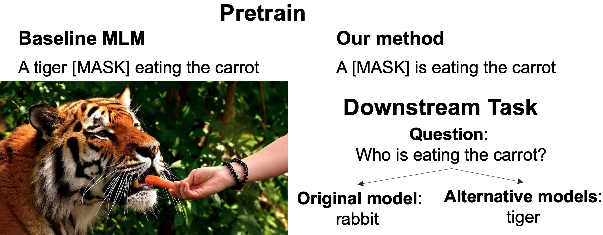
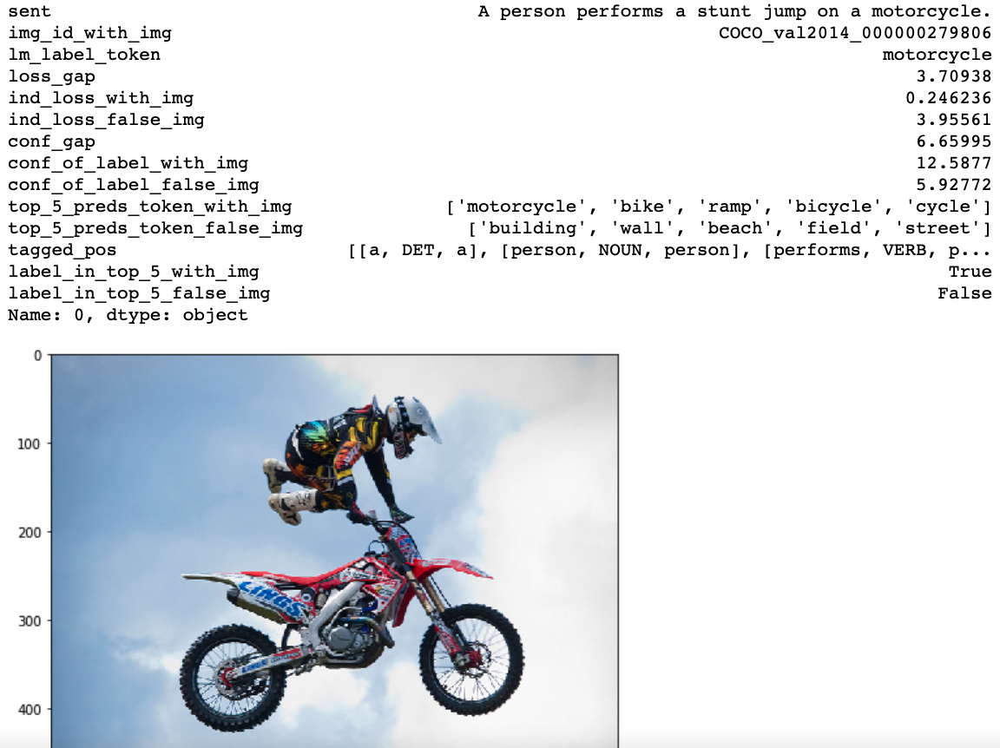

# Data Efficient Masked Language Modeling for Vision and Language
Repository for the paper "Data Efficient Masked Language Modeling for Vision and Language".

The baseline MLM masks a random token with 15\% probability (where ~50\% of the masked tokens are stop-words or punctuation). Our method masks words that require the image in order to be predicted (e.g., physical objects).
Our experiments show that our pretrain masking strategy consistently improves over the baseline strategy in two evaluation setups. 

## Intro

The code for pretraining is based on the great LXMERT repository: https://github.com/airsplay/lxmert  

This repository includes:    
A. Data:  
- Pretrained models and fine-tuned models are available here: `URL`.  
- Sets of annotated Objects, Attributes, Relationships from GQA and Visual Genome.  
- Aggregated data, where we extracted Δ Validation loss (loss without the image, minus the loss with the image) for LXMERT validation set. This is used to define the necessity of the image for a masked word prediction during MLM.  
- Concreteness rating from the paper "Concreteness ratings for 40 thousand generally known English word lemmas", available in the data directory, `Concreteness_ratings_Brysbaert_et_al_BRM.xlsx`  
The data is available here URL. The structure of the csv is as follows:   
-- We can see the sentence, the image, and the masked token (motorcycle).  
-- 'ind_loss_with_img' is the loss with the image, 'ind_loss_false_img' is the loss without the image, and 'loss_gap' is the Δ Validation loss.  
-- Similar for 'conf_gap_of_label_with_img', 'conf_gap_of_label_false_img', and 'conf_gap' - it is the confidence of the model (logits at location of the masked word).  
-- 'top_5_preds_token_with_img', 'top_5_preds_token_false_img' - predictions of the model, with and without the image.  
-- 'tagged_pos' - there is also the spacy pos tag for the sentence.   

B. Code:  
- Code for the alternative masking strategies, available in `src/alternative_masking_strategies.py`  
- Semantic classes information, including functions to detect _Objects_, _Attributes_, and _Relationships_, available in `src/semantic_types_information.py`   

# data_efficient_masked_language_modeling_for_vision_and_language
